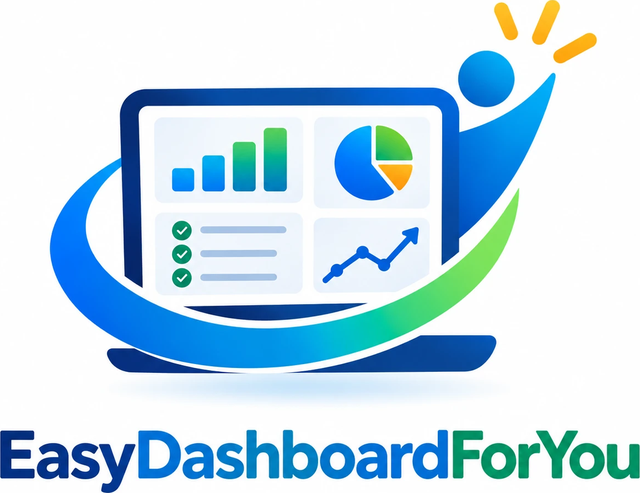

<p align="center"></p>

# EasyDashboardForYou

Turn any spreadsheet into a filterable, sortable, editable dashboard, then export it back.

**Live app:** https://uzi-tzur.github.io/EasyDashboardForYou/

## Run it

Use the live app above, or run it locally. You can double-click `index.html` to open it, or serve the folder (recommended, because Google Sheets import needs it):

```bash
python -m http.server 8765
```

Then open http://localhost:8765. There is no build step and nothing to install. Excel support loads SheetJS from a CDN.

## How it works

1. **Import** your data in one of these ways:
   - an Excel / CSV file (you can also drag and drop it onto the page),
   - a Google Sheet link (the sheet must be shared as *Anyone with the link can view*; the tab in the link's `gid` is the one imported),
   - cells pasted from Excel or Google Sheets.
2. **Field mapping**: for each source column, choose:
   - whether to show it,
   - its display name and column order,
   - how it is displayed: *Text, Long text, Number, Date, Badge, Tags (comma-separated pills), Status*,
   - whether it gets a filter,
   - whether it gets a breakdown chart.

   In the same dialog you can also **add new Status or Badge values** (they appear in filters and in the cell dropdown before any row uses them), **rename any value**, **delete a value** (you choose whether its rows become empty or switch to another value), **reorder values** with ↑↓ or drag (the order is used by filters, cell dropdowns, charts and column sorting) (every row using it is updated; renaming to an existing value merges them) and pick its **colour** (or leave it on Auto). You also set the dashboard title, the field that colours the row bar, and the **summary cards** (each card counts the visible rows where a field contains a value). The app pre-fills a best guess for every column.
3. **Use the dashboard**:
   - Summary cards show each count with its share of the visible records. Click a card to show only those rows.
   - Breakdown charts show how records split by a field. Click a bar to filter by that value.
   - Status values are coloured by meaning: green for done or approved, amber for pending or in review, red for blocked or failed, blue for in progress, grey otherwise.
   - Use the filter dropdowns above the table. Values within a field are OR, filters across fields are AND. Active filters appear as chips you can remove one at a time.
   - Search, and click column headers to sort.
   - **Click any cell to edit it.** Status and Badge cells open a dropdown of all values, including a “+ New value…” option. Enter saves, Esc cancels, Tab moves to the next cell.
   - Add rows or delete them (deleting can be undone).
   - Click the title to rename it.

   Changes are saved automatically in your browser.
4. **Export**:
   - CSV or Excel (.xlsx).
   - **Google Sheets (sign in)**: signs in with Google and writes the data straight into a new spreadsheet. Later exports can replace the data in that same spreadsheet. This needs a one-time setup (see below).
   - **Copy for Google Sheets (paste)**: copies the data so you can paste it into a new sheet with Ctrl+V. This needs no setup.
   - **Print / Save as PDF**: prints the dashboard without the toolbar.
   - Export includes either the visible rows only or all rows.
   - Export uses the dashboard field names, so you can re-import the file later and it maps itself automatically.

## Google Sheets export setup

Google requires each app to have its own OAuth **Client ID**. A Client ID is a public identifier, not a secret. You set it up once:

1. In the [Google Cloud Console](https://console.cloud.google.com/projectcreate), create a project.
2. Enable the [Google Sheets API](https://console.cloud.google.com/apis/library/sheets.googleapis.com).
3. Configure the [OAuth consent screen](https://console.cloud.google.com/auth/overview) as *External*. Then either add the people who will use it as **test users**, or publish the app. The only scope it uses is `drive.file`, which is not a sensitive scope.
4. Under [Clients](https://console.cloud.google.com/auth/clients), create an OAuth client of type **Web application**. Add these **Authorized JavaScript origins**:
   - `https://uzi-tzur.github.io`
   - `http://localhost:8765` (for local use)
5. Put the Client ID in `js/config.js` (`googleClientId`) so everyone using the site gets it. Alternatively, paste it into the export dialog, which saves it in that browser only.

**Privacy:** the app asks only for the `drive.file` permission. It can create spreadsheets and edit the ones it created, but it cannot see anything else in your Drive. The sign-in token stays in memory and is never stored.

## Templates

*Export → Save template* writes the mapping (fields, types, filters, cards, title) to a `.json` file. *Import → Load template* applies it to a new data set, and columns are matched by name.

`samples/` contains the Release Tracking example as a CSV plus its template. *Import → Load sample* loads it in one click.

## Files

| File | Purpose |
|---|---|
| `index.html` | Page layout and dialogs |
| `css/styles.css` | Styling (light + dark mode) |
| `js/app.js` | Import, mapping, rendering, editing, export |
| `js/google-sheets.js` | Google sign-in and direct Sheets export |
| `js/config.js` | Settings (Google Client ID) |
| `js/sample.js` | Built-in Release Tracking sample |

---

Created by Uzi Tzur. All rights reserved. Contact: 214.354.0604
